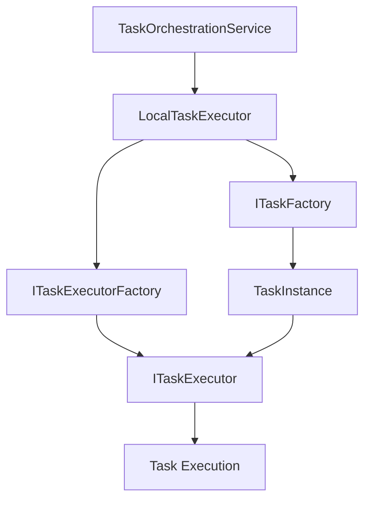

# Task Executors

## Overview

The Task Execution System is responsible for executing different types of tasks within workflow transitions. It follows the Strategy Pattern to provide specialized executors for various task types, enabling extensible and maintainable task processing.

## Architecture

### Task Execution Flow

The task execution system consists of three main components working together within the modular architecture:

1. **TaskOrchestrationService (`BBT.Workflow.Orchestration`)**: Orchestrates task execution with support for parallel and sequential strategies
2. **LocalTaskExecutor (`BBT.Workflow.Execution.Tasks`)**: Handles local task execution with optimized performance  
3. **ITaskExecutor**: Executes specific task types with specialized logic



### TaskOrchestrationService (`BBT.Workflow.Orchestration`)

The `TaskOrchestrationService` coordinates task execution with optimized performance and supports both parallel and sequential execution strategies.

```csharp
namespace BBT.Workflow.Orchestration;

public sealed class TaskOrchestrationService : ITaskOrchestrationService
{
    public async Task ExecuteAsync(
        IEnumerable<OnExecuteTask> onExecuteTasks,
        InstanceTransition? instanceTransition,
        TaskTrigger taskTrigger,
        ScriptContext context,
        CancellationToken cancellationToken = default)
    {
        var tasks = onExecuteTasks.ToList();
        if (!tasks.Any()) return;

        // Check if tasks can be executed in parallel (no dependencies)
        var canExecuteInParallel = CanExecuteInParallel(tasks);

        if (canExecuteInParallel)
        {
            await ExecuteTasksInParallelAsync(tasks, instanceTransition, taskTrigger, context, cancellationToken);
        }
        else
        {
            await ExecuteTasksSequentiallyAsync(tasks, instanceTransition, taskTrigger, context, cancellationToken);
        }
    }

    public async Task<bool> ExecuteConditionAsync(
        ScriptCode script,
        ScriptContext context,
        CancellationToken cancellationToken = default)
    {
        var task = ConditionTask.Create();
        var taskExecutor = taskExecutorFactory.GetExecutor(task.GetTaskType());

        var response = await taskExecutor.ExecuteAsync(task, script.DecodedCode, context, cancellationToken);
        return response as bool? ?? false;
    }

    private async Task ExecuteTasksInParallelAsync(
        IList<OnExecuteTask> onExecuteTasks,
        InstanceTransition? instanceTransition,
        TaskTrigger taskTrigger,
        ScriptContext context,
        CancellationToken cancellationToken)
    {
        var executionTasks = onExecuteTasks.Select(async onExecuteTask =>
        {
            await taskOrchestrator.ExecuteTaskAsync(onExecuteTask, instanceTransition, taskTrigger, context, cancellationToken);
        });

        await Task.WhenAll(executionTasks);
    }

    private async Task ExecuteTasksSequentiallyAsync(
        IList<OnExecuteTask> onExecuteTasks,
        InstanceTransition? instanceTransition,
        TaskTrigger taskTrigger,
        ScriptContext context,
        CancellationToken cancellationToken)
    {
        foreach (var onExecuteTask in onExecuteTasks)
        {
            await taskOrchestrator.ExecuteTaskAsync(onExecuteTask, instanceTransition, taskTrigger, context, cancellationToken);
        }
    }
}
```

### LocalTaskExecutor (`BBT.Workflow.Execution.Tasks`)

The `LocalTaskExecutor` handles local task execution with optimized task creation and proper instance isolation.

```csharp
namespace BBT.Workflow.Execution.Tasks;

public sealed class LocalTaskExecutor : ITaskOrchestrator
{
    public async Task ExecuteTaskAsync(
        OnExecuteTask onExecuteTask,
        InstanceTransition? instanceTransition,
        TaskTrigger taskTrigger,
        ScriptContext context,
        CancellationToken cancellationToken = default)
    {
        // Use TaskFactory for optimized task creation with proper isolation
        var task = await taskFactory.CreateExecutionTaskAsync(onExecuteTask.Task, cancellationToken);
        
        var taskExecutor = taskExecutorFactory.GetExecutor(task.GetTaskType());
        var instanceTask = new InstanceTask(
            guidGenerator.Create(),
            instanceTransition?.Id ?? guidGenerator.Create(),
            task.Key
        );

        // Get the appropriate persistence strategy based on TaskTrigger
        var persistenceStrategy = taskPersistenceStrategyFactory.GetStrategy(taskTrigger);
        
        try
        {
            var response = await taskExecutor.ExecuteAsync(
                task,
                onExecuteTask.Mapping.DecodedCode,
                context,
                cancellationToken);

            if (response != null)
            {
                // Use thread-safe operations for context updates
                lock (context.TaskResponse)
                {
                    var variableKey = task.Key.ToVariableName();
                    context.TaskResponse[variableKey] = response;
                }

                context.Instance.AddData(
                    guidGenerator.Create(),
                    new JsonData(JsonSerializer.Serialize(response, JsonSerializerConstants.JsonOptions)),
                    VersionStrategy.IncreasePatch
                );
            }

            instanceTask.Completed(
                new JsonData(JsonSerializer.Serialize(response, JsonSerializerConstants.JsonOptions)));
        }
        catch (Exception e)
        {
            instanceTask.Faulted(e.Message);
        }
        
        // Handle task completion persistence
        await persistenceStrategy.HandleCompletionAsync(instanceTask, cancellationToken);
    }
}
```

### Task Factory Integration

The TaskFactory ensures proper task instance isolation and prevents cache contamination:

```csharp
// BEFORE (Problematic - Direct Cache Access)
var task = await componentCacheStore.GetTaskAsync(reference, cancellationToken);
// This shares the cached instance across all requests!

// AFTER (Safe - Through TaskFactory)
var task = await taskFactory.CreateExecutionTaskAsync(reference, cancellationToken);
// This creates an isolated instance for each execution
```

The TaskFactory provides two implementation strategies:

#### Development/Low-Throughput
```csharp
services.AddScoped<ITaskFactory, TaskFactory>(); // Standard cloning
```

#### Production/High-Throughput
```csharp
services.AddSingleton<ITaskFactory, PooledTaskFactory>(); // Object pooling
```

**Configuration:**
```json
{
  "TaskFactory": {
    "UseObjectPooling": true,
    "MaxPoolSize": 1000,
    "InitialPoolSize": 100,
    "PooledTaskTypes": ["DaprServiceTask", "HttpTask", "ScriptTask"]
  }
}
```

### Task Persistence Strategies (`BBT.Workflow.Tasks.Persistence`)

The system uses pluggable persistence strategies based on task trigger types:

```csharp
namespace BBT.Workflow.Tasks.Persistence.Strategies;

public sealed class StandardTaskPersistenceStrategy : ITaskPersistenceStrategy
{
    public bool CanHandle(TaskTrigger taskTrigger)
    {
        return taskTrigger is TaskTrigger.OnExecute or TaskTrigger.OnEntry or TaskTrigger.OnExit;
    }

    public async Task HandleCreationAsync(InstanceTask instanceTask, CancellationToken cancellationToken = default)
    {
        await instanceTaskRepository.InsertAsync(instanceTask, true, cancellationToken);
    }

    public async Task HandleCompletionAsync(InstanceTask instanceTask, CancellationToken cancellationToken = default)
    {
        await instanceTaskRepository.UpdateAsync(instanceTask, true, cancellationToken);
    }
}

public sealed class ExtensionTaskPersistenceStrategy : ITaskPersistenceStrategy
{
    public bool CanHandle(TaskTrigger taskTrigger)
    {
        return taskTrigger == TaskTrigger.Extension;
    }

    public async Task HandleCreationAsync(InstanceTask instanceTask, CancellationToken cancellationToken = default)
    {
        // Extensions typically don't persist task records during creation
        await Task.CompletedTask;
    }

    public async Task HandleCompletionAsync(InstanceTask instanceTask, CancellationToken cancellationToken = default)
    {
        // Only persist completed extension tasks for audit trail
        await instanceTaskRepository.InsertAsync(instanceTask, true, cancellationToken);
    }
}
```

### Task Executor Factory

The `ITaskExecutorFactory` creates appropriate executors based on task types.

```csharp
public interface ITaskExecutorFactory
{
    ITaskExecutor GetExecutor(TaskType type);
}

public sealed class TaskExecutorFactory(IServiceProvider serviceProvider) : ITaskExecutorFactory
{
    public ITaskExecutor GetExecutor(TaskType type)
    {
        return type switch
        {
            TaskType.Http => serviceProvider.GetRequiredService<HttpTaskExecutor>(),
            TaskType.DaprHttpEndpoint => serviceProvider.GetRequiredService<DaprHttpEndpointTaskExecutor>(),
            TaskType.DaprBinding => serviceProvider.GetRequiredService<DaprBindingTaskExecutor>(),
            TaskType.DaprService => serviceProvider.GetRequiredService<DaprServiceTaskExecutor>(),
            TaskType.DaprPubSub => serviceProvider.GetRequiredService<DaprPubSubTaskExecutor>(),
            TaskType.Script => serviceProvider.GetRequiredService<ScriptTaskExecutor>(),
            TaskType.Human => serviceProvider.GetRequiredService<DaprHumanTaskExecutor>(),
            _ => throw new ArgumentOutOfRangeException(nameof(type), type, null)
        };
    }
}
```

### Base Task Executor

All task executors inherit from the base `TaskExecutor` class:

```csharp
public abstract class TaskExecutor(IScriptEngine scriptEngine)
{
    protected IScriptEngine ScriptEngine { get; } = scriptEngine;

    protected virtual async Task<ScriptResponseDto> PrepareInputAsync(
        WorkflowTask task,
        string scriptCode,
        ScriptContext context,
        CancellationToken cancellationToken)
    {
        var scriptRunner = await ScriptEngine.CompileToInstanceAsync<IMapping>(
            scriptCode, 
            cancellationToken: cancellationToken);
        return await scriptRunner.InputHandler(task, context);
    }

    protected virtual async Task<ScriptResponseDto> ProcessOutputAsync(
        string scriptCode,
        ScriptContext context,
        CancellationToken cancellationToken)
    {
        var scriptRunner = await ScriptEngine.CompileToInstanceAsync<IMapping>(
            scriptCode, 
            cancellationToken: cancellationToken);
        return await scriptRunner.OutputHandler(context);
    }
}
```

### Task Executor Interface

```csharp
public interface ITaskExecutor
{
    Task<object?> ExecuteAsync(
        WorkflowTask task,
        string scriptCode,
        ScriptContext context,
        CancellationToken cancellationToken = default);
}
```

## Built-in Executors

### 1. HttpTaskExecutor

Executes HTTP requests to external APIs.

```csharp
public sealed class HttpTaskExecutor(
    IScriptEngine scriptEngine,
    IHttpClientFactory httpClientFactory) : TaskExecutor(scriptEngine), ITaskExecutor
{
    public async Task<object?> ExecuteAsync(
        WorkflowTask task,
        string scriptCode,
        ScriptContext context,
        CancellationToken cancellationToken = default)
    {
        var httpTask = (task as HttpTask)!;

        // 1. Prepare input through script mapping
        var inputResponse = await PrepareInputAsync(task, scriptCode, context, cancellationToken);

        // 2. Create HTTP client and request
        var httpClient = httpClientFactory.CreateClient();
        var request = new HttpRequestMessage(
            new HttpMethod(httpTask.HttpMethod),
            httpTask.Url);

        // 3. Set headers
        foreach (var header in httpTask.Headers)
        {
            request.Headers.TryAddWithoutValidation(header.Key, header.Value);
        }

        // 4. Set request body for non-GET requests
        if (request.Method != HttpMethod.Get && inputResponse.Data != null)
        {
            request.Content = new StringContent(
                JsonSerializer.Serialize(inputResponse.Data),
                Encoding.UTF8,
                "application/json");
        }

        // 5. Execute HTTP request
        var response = await httpClient.SendAsync(request, cancellationToken);
        var responseContent = await response.Content.ReadAsStringAsync(cancellationToken);

        // 6. Process response through script mapping
        context.SetBody(JsonSerializer.Deserialize<dynamic>(responseContent));
        var outputResponse = await ProcessOutputAsync(scriptCode, context, cancellationToken);
        
        return outputResponse.Data;
    }
}
```

**Configuration Example:**
```json
{
  "key": "credit-check-api",
  "type": "6",
  "config": {
    "url": "https://api.creditbureau.com/check",
    "httpMethod": "POST",
    "headers": {
      "Authorization": "Bearer ${context.headers.apiKey}",
      "Content-Type": "application/json"
    },
    "timeout": "PT30S"
  }
}
```

### 2. DaprServiceTaskExecutor

Executes DAPR service invocation calls.

```csharp
public sealed class DaprServiceTaskExecutor(
    IScriptEngine scriptEngine,
    DaprClient daprClient) : TaskExecutor(scriptEngine), ITaskExecutor
{
    public async Task<object?> ExecuteAsync(
        WorkflowTask task,
        string scriptCode,
        ScriptContext context,
        CancellationToken cancellationToken = default)
    {
        var daprTask = (task as DaprServiceTask)!;

        // 1. Prepare input data
        var inputResponse = await PrepareInputAsync(task, scriptCode, context, cancellationToken);

        // 2. Create DAPR service invocation request
        var request = daprClient.CreateInvokeMethodRequest(
            new HttpMethod(daprTask.HttpVerb),
            daprTask.AppId,
            daprTask.MethodName);

        // 3. Set request content for non-GET requests
        if (request.Method != HttpMethod.Get && inputResponse.Data != null)
        {
            request.Content = new StringContent(
                JsonSerializer.Serialize(inputResponse.Data),
                Encoding.UTF8,
                "application/json");
        }

        // 4. Invoke DAPR service
        var response = await daprClient.InvokeMethodAsync<dynamic?>(
            request,
            cancellationToken: cancellationToken);

        // 5. Process response
        context.SetBody(response);
        var outputResponse = await ProcessOutputAsync(scriptCode, context, cancellationToken);
        
        return outputResponse.Data;
    }
}
```

**Configuration Example:**
```json
{
  "key": "notify-customer",
  "type": "3",
  "config": {
    "appId": "notification-service",
    "methodName": "send-notification",
    "httpVerb": "POST"
  }
}
```

### 3. ScriptTaskExecutor

Executes C# scripts for business logic.

```csharp
public sealed class ScriptTaskExecutor(IScriptEngine scriptEngine) : ITaskExecutor
{
    public async Task<object?> ExecuteAsync(
        WorkflowTask task,
        string scriptCode,
        ScriptContext context,
        CancellationToken cancellationToken = default)
    {
        var scriptTask = (task as ScriptTask)!;

        // 1. Compile and execute script
        var scriptRunner = await scriptEngine.CompileToInstanceAsync<IScriptExecution>(
            scriptTask.Script.Code,
            cancellationToken: cancellationToken);

        // 2. Execute script with context
        var result = await scriptRunner.ExecuteAsync(context, cancellationToken);

        // 3. Process output if mapping script provided
        if (!string.IsNullOrEmpty(scriptCode))
        {
            context.SetBody(result);
            var mappingRunner = await scriptEngine.CompileToInstanceAsync<IMapping>(
                scriptCode,
                cancellationToken: cancellationToken);
            var mappingResult = await mappingRunner.OutputHandler(context);
            return mappingResult.Data;
        }

        return result;
    }
}
```

**Configuration Example:**
```json
{
  "key": "calculate-interest",
  "type": "7",
  "config": {
    "script": "var rate = context.data.creditScore > 700 ? 0.05 : 0.08; return context.data.amount * rate;",
    "language": "csharp"
  }
}
```

### 4. DaprHumanTaskExecutor

Handles human tasks through DAPR pub/sub.

```csharp
public sealed class DaprHumanTaskExecutor(
    IScriptEngine scriptEngine,
    DaprClient daprClient) : TaskExecutor(scriptEngine), ITaskExecutor
{
    public async Task<object?> ExecuteAsync(
        WorkflowTask task,
        string scriptCode,
        ScriptContext context,
        CancellationToken cancellationToken = default)
    {
        var humanTask = (task as HumanTask)!;

        // 1. Prepare task data
        var inputResponse = await PrepareInputAsync(task, scriptCode, context, cancellationToken);

        // 2. Create human task payload
        var taskPayload = new
        {
            TaskId = Guid.NewGuid(),
            InstanceId = context.Instance.Id,
            Title = humanTask.Title,
            Instructions = humanTask.Instructions,
            AssignedTo = humanTask.AssignedTo,
            DueDate = humanTask.DueDate,
            Form = humanTask.Form,
            Data = inputResponse.Data
        };

        // 3. Publish to human task topic
        await daprClient.PublishEventAsync(
            "pubsub",
            "human-tasks",
            taskPayload,
            cancellationToken);

        // 4. Return task reference for tracking
        return new { TaskId = taskPayload.TaskId, Status = "Assigned" };
    }
}
```

### 5. DaprBindingTaskExecutor

Executes DAPR output bindings for external integrations.

```csharp
public sealed class DaprBindingTaskExecutor(
    IScriptEngine scriptEngine,
    DaprClient daprClient) : TaskExecutor(scriptEngine), ITaskExecutor
{
    public async Task<object?> ExecuteAsync(
        WorkflowTask task,
        string scriptCode,
        ScriptContext context,
        CancellationToken cancellationToken = default)
    {
        var bindingTask = (task as DaprBindingTask)!;

        // 1. Prepare input data
        var inputResponse = await PrepareInputAsync(task, scriptCode, context, cancellationToken);

        // 2. Execute DAPR binding
        var bindingRequest = new BindingRequest(
            bindingTask.BindingName,
            bindingTask.Operation)
        {
            Data = JsonSerializer.SerializeToUtf8Bytes(inputResponse.Data),
            Metadata = bindingTask.Metadata
        };

        var response = await daprClient.InvokeBindingAsync(bindingRequest, cancellationToken);

        // 3. Process response
        if (response.Data.Length > 0)
        {
            var responseData = JsonSerializer.Deserialize<dynamic>(response.Data);
            context.SetBody(responseData);
            var outputResponse = await ProcessOutputAsync(scriptCode, context, cancellationToken);
            return outputResponse.Data;
        }

        return null;
    }
}
```

## Script Context

The `ScriptContext` provides execution context to task executors:

```csharp
public sealed class ScriptContext
{
    public Instance Instance { get; private set; }
    public Workflow Workflow { get; private set; }
    public Transition? Transition { get; private set; }
    public JsonElement? Attributes { get; private set; }
    public object? Body { get; private set; }
    public IReadOnlyDictionary<string, string>? Headers { get; private set; }
    public Dictionary<string, object?> RouteValues { get; private set; }
    public Guid TransitionId { get; private set; }
    public Dictionary<string, object?> TaskResponse { get; private set; } = new();

    public class Builder
    {
        private Instance? _instance;
        private Workflow? _workflow;
        private Transition? _transition;
        private object? _body;
        private Dictionary<string, string>? _headers;
        private Dictionary<string, object?> _routeValues = new();

        public Builder SetInstance(Instance instance)
        {
            _instance = instance;
            return this;
        }

        public Builder SetWorkflow(Workflow workflow)
        {
            _workflow = workflow;
            return this;
        }

        public Builder SetTransition(Transition transition)
        {
            _transition = transition;
            return this;
        }

        public Builder SetBody(object? body)
        {
            _body = body;
            return this;
        }

        public Builder SetHeaders(Dictionary<string, string>? headers)
        {
            _headers = headers;
            return this;
        }

        public Builder SetRouteValues(Dictionary<string, object?> routeValues)
        {
            _routeValues = routeValues;
            return this;
        }

        public ScriptContext Build()
        {
            return new ScriptContext
            {
                Instance = _instance ?? throw new ArgumentNullException(nameof(_instance)),
                Workflow = _workflow ?? throw new ArgumentNullException(nameof(_workflow)),
                Transition = _transition,
                Body = _body,
                Headers = _headers,
                RouteValues = _routeValues,
                TransitionId = _transition?.Id ?? Guid.Empty
            };
        }
    }

    public void SetBody(object? body)
    {
        Body = body;
    }
}
```

## Performance Optimizations

### 1. Task Factory Benefits

- **Cache Safety**: Eliminates cache contamination by creating isolated task instances
- **Performance**: Object pooling support for high-throughput scenarios (60-80% improvement)
- **Memory Optimization**: Reduces GC pressure through object reuse
- **Configuration-Driven**: Environment-specific optimization strategies

### 2. Parallel vs Sequential Execution

The orchestration service automatically determines the optimal execution strategy:

```csharp
private static bool CanExecuteInParallel(IList<OnExecuteTask> tasks)
{
    // Simple heuristic: if tasks have different orders, they might have dependencies
    // In a more sophisticated implementation, you would analyze actual dependencies
    var orders = tasks.Select(t => t.Order).Distinct().ToList();
    return orders.Count == 1 || tasks.Count == 1;
}
```

### 3. Thread-Safe Context Updates

For concurrent task execution, context updates use thread-safe operations:

```csharp
if (response != null)
{
    lock (context.TaskResponse)
    {
        var variableKey = task.Key.ToVariableName();
        context.TaskResponse[variableKey] = response;
    }
}
```

## Configuration and Dependency Injection

```csharp
public static IServiceCollection AddTaskExecutionServices(this IServiceCollection services)
{
    // Orchestration Services
    services.AddScoped<ITaskOrchestrationService, TaskOrchestrationService>();
    
    // Execution Services
    services.AddScoped<ITaskOrchestrator, LocalTaskExecutor>();
    
    // Task Executors
    services.AddScoped<ITaskExecutorFactory, TaskExecutorFactory>();
    services.AddScoped<HttpTaskExecutor>();
    services.AddScoped<DaprBindingTaskExecutor>();
    services.AddScoped<DaprHttpEndpointTaskExecutor>();
    services.AddScoped<DaprHumanTaskExecutor>();
    services.AddScoped<DaprPubSubTaskExecutor>();
    services.AddScoped<DaprServiceTaskExecutor>();
    services.AddScoped<ScriptTaskExecutor>();
    services.AddScoped<ConditionTaskExecutor>();

    // Task Factory Configuration
    services.ConfigureTaskFactory();
    
    // Persistence Strategies
    services.AddScoped<ITaskPersistenceStrategy, StandardTaskPersistenceStrategy>();
    services.AddScoped<ITaskPersistenceStrategy, ExtensionTaskPersistenceStrategy>();
    services.AddScoped<ITaskPersistenceStrategyFactory, TaskPersistenceStrategyFactory>();

    return services;
}

private static IServiceCollection ConfigureTaskFactory(this IServiceCollection services)
{
    services.AddOptions<TaskFactoryOptions>()
        .BindConfiguration(TaskFactoryOptions.SectionName)
        .ValidateDataAnnotations()
        .ValidateOnStart();

    services.AddScoped<ITaskFactory>(serviceProvider =>
    {
        var options = serviceProvider.GetRequiredService<IOptions<TaskFactoryOptions>>();
        var componentCacheStore = serviceProvider.GetRequiredService<IComponentCacheStore>();

        if (options.Value.UseObjectPooling)
        {
            return serviceProvider.GetRequiredService<PooledTaskFactory>();
        }

        var logger = serviceProvider.GetRequiredService<ILogger<TaskFactory>>();
        return new TaskFactory(componentCacheStore, logger);
    });

    services.AddScoped<TaskFactory>();
    services.AddSingleton<PooledTaskFactory>();

    return services;
}
```

## Best Practices

### 1. Task Isolation
Always use TaskFactory for creating task instances to prevent cache contamination.

### 2. Error Handling
Implement comprehensive error handling with proper task state transitions.

### 3. Performance Optimization
Use object pooling in production environments for high-throughput scenarios.

### 4. Thread Safety
Ensure thread-safe operations when updating shared context in parallel executions.

### 5. Persistence Strategy Selection
Choose appropriate persistence strategies based on task trigger types and requirements.

### 6. Script Context Management
Build script context properly with all required information for task execution.

### 7. Development Automation
For efficient development of task scripts and workflow rules, use the automated development tools:

- **CSX to JSON Conversion**: Automatically converts script files to base64 encoded JSON format
- **File Watching**: Real-time updates during development
- **VS Code Integration**: Streamlined development workflow with keyboard shortcuts

See [Workflow Development Automation](./workflow-development-automation.md) for setup and usage details.

The modular task execution system provides a robust, scalable, and maintainable approach to handling various task types while ensuring optimal performance and proper separation of concerns. 