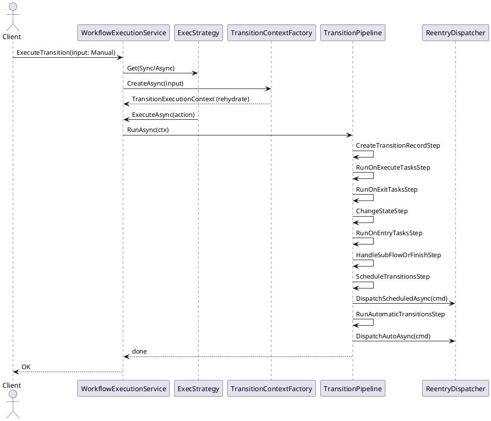

# vNext Transition Mimari Revizyonu – Lifecycle Pipeline, Trigger Handlers ve Re‑entry

> Amaç: Transition yürütmeyi **okunabilir, test edilebilir, genişletilebilir** hale getirmek; `StateMachineExecutor` üzerindeki karmaşıklığı düşürmek ve Auto/Schedule gibi **re‑entry** (yeni scope ile yeniden çağırma) senaryolarını ilk sınıf vatandaş olarak tanımlamak.

---

## 1) Hedefler ve İlkeler

- **SRP & Ayrık Sorumluluk:** Sync/Async mod seçimi ≠ Trigger tipi yönetimi ≠ Lifecycle adımlarının yürütülmesi.
- **Deterministik Lifecycle:** Belirli ve dokümante edilmiş sıra: `OnExecute → OnExit → ChangeState → OnEntry → (Finish/SubFlow) → Schedule → Auto → Finalize`.
- **Context Rehydrate:** Auto/Schedule gibi re‑entry’de **Context taşınmaz;** yeni DI scope’ta **yeniden kurulur**.
- **Service Locator Yok:** Servisler **Context** içinde değil, **adımlara/handler’lara DI** ile verilir.
- **Idempotency & Lock:** Instance bazlı kilit ve idempotency ana akış özelliğidir.

---

## 2) Yüksek Seviye Mimari

```
WorkflowExecutionService (Orkestratör)
  ├─ ExecutionStrategyFactory ........... (Sync/Async)
  ├─ TransitionHandlerFactory ........... (Manual/Automatic/Scheduled/Event)
  ├─ TransitionContextFactory ........... (rehydrate)
  └─ TransitionPipeline (ordered steps).. (Lifecycle’ın kendisi)
        ├─ CreateTransitionRecordStep
        ├─ RunOnExecuteTasksStep
        ├─ RunOnExitTasksStep
        ├─ ChangeStateStep
        ├─ RunOnEntryTasksStep
        ├─ HandleSubFlowOrFinishStep
        ├─ ScheduleTransitionsStep
        ├─ RunAutomaticTransitionsStep
        └─ FinalizeTransitionStep

Re‑entry
  ├─ IReentryDispatcher (Auto/Schedule)
  ├─ DefaultReentryDispatcher (inline new scope / enqueue)
  └─ TransitionJobHandler (worker, new scope → WorkflowExecutionService)
```

---

## 3) Çekirdek Arayüzler ve Sözleşmeler

### 3.1 Execution Strategy (mevcut – korunur)

```csharp
public interface ITransitionStrategy
{
    Task ExecuteAsync(Func<Task> action, CancellationToken ct);
}

public sealed class SyncTransitionStrategy : ITransitionStrategy { /* ... */ }
public sealed class AsyncTransitionStrategy : ITransitionStrategy { /* ... */ }

public interface IExecutionStrategyFactory
{
    ITransitionStrategy Get(ExecMode mode); // Sync | Async
}
```

### 3.2 Trigger Handlers (yeni)

```csharp
public enum TriggerType { Manual, Automatic, Scheduled, Event }

public interface ITransitionHandler
{
    bool CanHandle(TriggerType triggerType);
    Task PreHandleAsync(TransitionExecutionContext ctx, CancellationToken ct);
    Task PostHandleAsync(TransitionExecutionContext ctx, CancellationToken ct);
}
```

Örnekler:

```csharp
public sealed class ManualTransitionHandler : TransitionHandlerBase
{
    public override bool CanHandle(TriggerType t) => t == TriggerType.Manual;
    protected override Task PreValidateAsync(TransitionExecutionContext ctx, CancellationToken ct)
    {
        // Policy/HMAC/Auth/Schema validation
        return Task.CompletedTask;
    }
}

public sealed class AutomaticTransitionHandler : TransitionHandlerBase
{
    private readonly IConditionService _conditions;
    public override bool CanHandle(TriggerType t) => t == TriggerType.Automatic;
    protected override async Task PreValidateAsync(TransitionExecutionContext ctx, CancellationToken ct)
    {
        var ok = await _conditions.EvaluateAsync(ctx.Transition, ctx.GetOrBuildScriptContext(), ct);
        if (!ok) throw new InvalidOperationException("Auto rule blocked transition.");
    }
}

public sealed class ScheduledTransitionHandler : TransitionHandlerBase
{
    public override bool CanHandle(TriggerType t) => t == TriggerType.Scheduled;
    protected override Task PreValidateAsync(TransitionExecutionContext ctx, CancellationToken ct)
    {
        ctx.SkipImmediateExecution = true; // schedule adımında sadece enqueue
        return Task.CompletedTask;
    }
}
```

### 3.3 Transition Pipeline (Lifecycle)

```csharp
public interface ITransitionStep { int Order { get; } Task ExecuteAsync(TransitionExecutionContext ctx, CancellationToken ct); }

public sealed class TransitionPipeline
{
    private readonly IReadOnlyList<ITransitionStep> _steps;
    public TransitionPipeline(IEnumerable<ITransitionStep> steps) => _steps = steps.OrderBy(s => s.Order).ToList();
    public async Task RunAsync(TransitionExecutionContext ctx, CancellationToken ct)
    {
        foreach (var s in _steps)
        {
            if (ctx.SkipImmediateExecution) break; // Schedule için hemen koşma
            await s.ExecuteAsync(ctx, ct);
        }
    }
}
```

**Order sabitleri** (okunabilirlik amaçlı):

```csharp
public static class LifecycleOrder
{
    public const int CreateTransition = 10;
    public const int OnExecute        = 20;
    public const int OnExit           = 30;
    public const int ChangeState      = 40;
    public const int OnEntry          = 50;
    public const int FinishOrSubflow  = 60;
    public const int Schedule         = 70;
    public const int Auto             = 80;
    public const int Finalize         = 90;
}
```

### 3.4 Re‑entry (Decorator‑like yeniden çağrı)

```csharp
public sealed record ReentryCommand(
    Guid InstanceId,
    string Domain,
    string WorkflowKey,
    string TransitionKey,
    TriggerType TriggerType,
    string? Actor = null,
    string? ExecutionChainId = null,
    int ChainDepth = 0,
    bool PreferInline = false,
    IReadOnlyDictionary<string,string>? Headers = null
);

public interface IReentryDispatcher
{
    Task DispatchAutoAsync(ReentryCommand cmd, CancellationToken ct);
    Task DispatchScheduledAsync(ReentryCommand cmd, CancellationToken ct);
}
```

Varsayılan uygulama (özet):

```csharp
public sealed class DefaultReentryDispatcher : IReentryDispatcher
{
    private readonly IServiceScopeFactory _scopeFactory;
    private readonly IBackgroundJobService _jobs;
    private readonly ReentryOptions _opt;

    public async Task DispatchAutoAsync(ReentryCommand cmd, CancellationToken ct)
    {
        var next = cmd with { ChainDepth = cmd.ChainDepth + 1 };
        if (next.ChainDepth > _opt.MaxAutoHops) return;

        if (cmd.PreferInline && _opt.AllowInlineAuto)
            await InvokeInNewScopeAsync(next, ct);
        else
            await _jobs.EnqueueAsync("auto-transition", next, ct);
    }

    public Task DispatchScheduledAsync(ReentryCommand cmd, CancellationToken ct)
        => _jobs.EnqueueAsync("scheduled-transition", cmd, ct);

    private async Task InvokeInNewScopeAsync(ReentryCommand cmd, CancellationToken ct)
    {
        using var scope = _scopeFactory.CreateScope();
        var exec = scope.ServiceProvider.GetRequiredService<IWorkflowExecutionService>();
        var input = WorkflowExecutionInput.From(cmd);
        await exec.ExecuteTransitionAsync(input, ct);
    }
}
```

---

## 4) TransitionExecutionContext – Minimal Model

> **Servis yok.** Context yalnızca kimlikler, instance/workflow snapshot’ı, birkaç bayrak ve headers/telemetry taşır. `ScriptContext` adım/handler içinde fabrika ile oluşturulur ve `Items`’ta cache edilebilir.

```csharp
public sealed class TransitionExecutionContext
{
    // Kimlik (immutable)
    public string  Domain          { get; init; }
    public Guid    InstanceId      { get; init; }
    public string  WorkflowKey     { get; init; }
    public string  TransitionKey   { get; init; }
    public TriggerType Trigger     { get; init; }
    public string  CorrelationId   { get; init; }
    public string? CausationId     { get; init; }
    public string  ExecutionChainId{ get; init; }
    public int     ChainDepth      { get; init; }
    public DateTimeOffset RequestedAt { get; init; }

    // Tanımlar (rehydrate edilen)
    public WorkflowDefinition Workflow { get; init; }
    public WorkflowState      Current  { get; set; }
    public WorkflowState?     Target   { get; set; }
    public WorkflowTransition Transition { get; init; }

    // Instance anlık durumu
    public InstanceAggregate  Instance { get; set; }
    public string             ConcurrencyToken { get; set; }
    public object?            Data     { get; set; }

    // Çalıştırma bayrakları
    public bool SkipImmediateExecution { get; set; }
    public bool IsReentry              { get; init; }

    // Telemetry & Headers & Temp bag
    public string TraceId { get; init; }
    public string SpanId  { get; init; }
    public IReadOnlyDictionary<string,string> Headers { get; init; } = new Dictionary<string,string>();
    public IDictionary<string,object?> Items { get; } = new Dictionary<string,object?>();

    // Yardımcı: adım/handler içinde ScriptContext cache'i
    public ScriptContext GetOrBuildScriptContext(Func<ScriptContext> factory)
    {
        if (Items.TryGetValue("ScriptContext", out var s) && s is ScriptContext sc) return sc;
        var created = factory();
        Items["ScriptContext"] = created;
        return created;
    }
}
```

### Context’in Üretilmesi (Factory)

```csharp
public interface ITransitionContextFactory
{
    Task<TransitionExecutionContext> CreateAsync(WorkflowExecutionInput input, CancellationToken ct);
}

public sealed class TransitionContextFactory : ITransitionContextFactory
{
    // ctor: repos/registries/factories enjekte edilir

    public async Task<TransitionExecutionContext> CreateAsync(WorkflowExecutionInput input, CancellationToken ct)
    {
        // 1) Domain/tenant → doğru schema
        // 2) Instance rehydrate (state+data)
        var instance = await _instances.GetAsync(input.InstanceId, includes: "State,Data", ct)
            ?? throw new NotFoundException("Instance not found");

        // 3) Workflow definition resolve (key+version)
        var wf = await _registry.ResolveAsync(input.WorkflowKey, input.WorkflowVersion ?? instance.WorkflowVersion, ct);

        // 4) State/Transition binding
        var current = wf.GetState(instance.CurrentState);
        var trans   = wf.ResolveTransition(input.TransitionKey, current);
        ValidateTriggerType(trans, input.TriggerType);

        // 5) Telemetry/ids
        var (traceId, spanId) = Telemetry.Init(input);

        return new TransitionExecutionContext
        {
            Domain = input.Domain,
            InstanceId = instance.Id,
            WorkflowKey = wf.Key,
            TransitionKey = trans.Key,
            Trigger = input.TriggerType,
            CorrelationId = input.CorrelationId ?? Guid.NewGuid().ToString("N"),
            CausationId = input.CausationId,
            ExecutionChainId = input.Execution?.ExecutionChainId ?? Guid.NewGuid().ToString("N"),
            ChainDepth = input.Execution?.ChainDepth ?? 0,
            RequestedAt = input.RequestedAt ?? DateTimeOffset.UtcNow,
            Headers = new Dictionary<string,string>(input.Headers ?? new Dictionary<string,string>()),
            Workflow = wf,
            Current = current,
            Transition = trans,
            Instance = instance,
            ConcurrencyToken = instance.RowVersion,
            Data = instance.Data,
            TraceId = traceId,
            SpanId = spanId,
            IsReentry = input.IsReentry
        };
    }
}
```

⸻

## 5) Lifecycle Adımları – Örnek Uygulamalar

### 5.1 CreateTransitionRecordStep

```csharp
public sealed class CreateTransitionRecordStep : ITransitionStep
{
    public int Order => LifecycleOrder.CreateTransition;
    private readonly IInstanceTransitionRepository _repo;

    public async Task ExecuteAsync(TransitionExecutionContext ctx, CancellationToken ct)
    {
        var record = InstanceTransition.Started(ctx.InstanceId, ctx.TransitionKey, ctx.Trigger, ctx.RequestedAt, ctx.CorrelationId, ctx.CausationId);
        await _repo.AddAsync(record, ct);
        ctx.Items["TransitionRecord"] = record; // diğer adımlar kullanabilir
    }
}
````

### 5.2 RunOnExecuteTasksStep (ScriptContext fabrika ile)
```csharp
public sealed class RunOnExecuteTasksStep : ITransitionStep
{
    public int Order => LifecycleOrder.OnExecute;
    private readonly ITaskOrchestrationService _tasks;
    private readonly IScriptContextFactory _scripts;

    public async Task ExecuteAsync(TransitionExecutionContext ctx, CancellationToken ct)
    {
        var script = ctx.GetOrBuildScriptContext(() => _scripts.Create(ctx.Instance, ctx.Workflow, ctx.Headers));
        await _tasks.ExecuteAsync(ctx.Transition.OnExecutionTasks, ctx.Instance, TaskTrigger.OnExecute, script, ct);
    }
}
```

### 5.3 ChangeStateStep
```csharp
public sealed class ChangeStateStep : ITransitionStep
{
    public int Order => LifecycleOrder.ChangeState;
    public Task ExecuteAsync(TransitionExecutionContext ctx, CancellationToken ct)
    {
        ctx.Instance.ChangeState(ctx.Transition);
        ctx.Target = ctx.Workflow.GetState(ctx.Instance.CurrentState);
        return Task.CompletedTask;
    }
}
```

### 5.4 ScheduleTransitionsStep (enqueue only)
```csharp
public sealed class ScheduleTransitionsStep : ITransitionStep
{
    public int Order => LifecycleOrder.Schedule;
    private readonly IScheduleAdapter _schedule;

    public async Task ExecuteAsync(TransitionExecutionContext ctx, CancellationToken ct)
    {
        if (ctx.Target?.ScheduledTransitions is null) return;
        foreach (var t in ctx.Target.ScheduledTransitions)
        {
            var script = ctx.GetOrBuildScriptContext(() => _scripts.Create(ctx.Instance, ctx.Workflow, ctx.Headers));
            var timer  = await t.Timer.Handler(script, ct); // ITimerMapping → TimerSchedule
            var cmd    = new ReentryCommand(ctx.InstanceId, ctx.Domain, ctx.WorkflowKey, t.Key, TriggerType.Scheduled, "system", ctx.ExecutionChainId, ctx.ChainDepth, false, ctx.Headers);
            await _schedule.EnqueueAsync(timer, cmd, ct);
        }
    }
}
```

### 5.5 RunAutomaticTransitionsStep (re‑entry dispatcher)
```csharp
public sealed class RunAutomaticTransitionsStep : ITransitionStep
{
    public int Order => LifecycleOrder.Auto;
    private readonly IConditionService _conditions;
    private readonly IReentryDispatcher _dispatcher;
    private readonly IScriptContextFactory _scripts;

    public async Task ExecuteAsync(TransitionExecutionContext ctx, CancellationToken ct)
    {
        if (ctx.Target?.AutomaticTransitions is null) return;
        var script = ctx.GetOrBuildScriptContext(() => _scripts.Create(ctx.Instance, ctx.Workflow, ctx.Headers));

        foreach (var t in ctx.Target.AutomaticTransitions)
        {
            if (!await _conditions.EvaluateAsync(t.Condition, script, ct)) continue;
            var cmd = new ReentryCommand(ctx.InstanceId, ctx.Domain, ctx.WorkflowKey, t.Key, TriggerType.Automatic, "system", ctx.ExecutionChainId, ctx.ChainDepth + 1, true, ctx.Headers);
            await _dispatcher.DispatchAutoAsync(cmd, ct);
        }
    }
}
```

⸻

## 6) StateMachineExecutor – Sade Orkestra
```csharp
public sealed class StateMachineExecutor : IStateMachineExecutor
{
    private readonly ITransitionHandlerFactory _handlerFactory;
    private readonly IExecutionStrategyFactory _execFactory;
    private readonly ITransitionContextFactory _ctxFactory;
    private readonly TransitionPipeline _pipeline;

    public async Task ExecuteTransitionAsync(WorkflowExecutionInput input, CancellationToken ct)
    {
        var handler = _handlerFactory.Get(input.TriggerType);
        var mode    = _execFactory.Get(input.Mode);

        await mode.ExecuteAsync(async () =>
        {
            var ctx = await _ctxFactory.CreateAsync(input, ct); // rehydrate
            await handler.PreHandleAsync(ctx, ct);
            await _pipeline.RunAsync(ctx, ct);
            await handler.PostHandleAsync(ctx, ct);
        }, ct);
    }
}
```

⸻

## 7) DI Kayıtları (özet)
```csharp
// Trigger handlers
services.AddScoped<ITransitionHandler, ManualTransitionHandler>();
services.AddScoped<ITransitionHandler, AutomaticTransitionHandler>();
services.AddScoped<ITransitionHandler, ScheduledTransitionHandler>();
services.AddScoped<ITransitionHandler, EventTransitionHandler>();
services.AddScoped<ITransitionHandlerFactory, TransitionHandlerFactory>();

// Strategies
services.AddScoped<ITransitionStrategy, SyncTransitionStrategy>();
services.AddScoped<ITransitionStrategy, AsyncTransitionStrategy>();
services.AddScoped<IExecutionStrategyFactory, ExecutionStrategyFactory>();

// Pipeline & steps (Order property ile sıralanır)
services.AddScoped<ITransitionStep, CreateTransitionRecordStep>();
services.AddScoped<ITransitionStep, RunOnExecuteTasksStep>();
services.AddScoped<ITransitionStep, RunOnExitTasksStep>();
services.AddScoped<ITransitionStep, ChangeStateStep>();
services.AddScoped<ITransitionStep, RunOnEntryTasksStep>();
services.AddScoped<ITransitionStep, HandleSubFlowOrFinishStep>();
services.AddScoped<ITransitionStep, ScheduleTransitionsStep>();
services.AddScoped<ITransitionStep, RunAutomaticTransitionsStep>();
services.AddScoped<ITransitionStep, FinalizeTransitionStep>();
services.AddScoped<TransitionPipeline>();

// Context & Re‑entry
services.AddScoped<ITransitionContextFactory, TransitionContextFactory>();
services.AddScoped<IReentryDispatcher, DefaultReentryDispatcher>();
services.Configure<ReentryOptions>(o => { o.MaxAutoHops = 12; o.AllowInlineAuto = true; });
```

⸻

## 8) Concurrency, Idempotency, Lock
	•	Idempotency Key: InstanceId + TransitionKey + Occurrence + ExecutionChainId → aynı işin iki kez çalışmasını engelle.
	•	Distributed Lock: InstanceId bazlı kilit (Dapr/Redis) → aynı anda iki transition çalışmasın.
	•	Tx Sınırı: Auto re‑entry enqueue/inline çağrıları commit sonrası tetiklenmeli (Outbox/Job garantisi).
	•	MaxAutoHops: Sonsuz otomatik geçiş halkasını kırmak için üst sınır.

⸻

## 9) Test Stratejisi
	•	Unit: Her ITransitionStep tek başına; ITransitionHandler pre/post mantığı; IReentryDispatcher karar mantığı.
	•	Integration: Pipeline’ın kanonik sırası + re‑entry inline/queued varyantları.
	•	Contract: TransitionContextFactory – farklı domain/schema, version, missing transition durumları.

⸻

## 10) Geçiş ve Uygulama Planı (Migration)
	1.	TransitionExecutionContext’i sadeleştir (servislerden arındır, minimal property seti).
	2.	ITransitionContextFactory ile rehydrate akışını ekle.
	3.	ITransitionStep adımlarını mevcut ExecuteTransition içinden ayıkla ve sırala.
	4.	Trigger Handler’ları (Manual/Auto/Schedule/Event) entegre et.
	5.	IReentryDispatcher + Worker ile Auto/Schedule re‑entry akışlarını devreye al.
	6.	Idempotency/Lock politikalarını merkezi hale getir.
	7.	E2E testleri ve metrikleri güncelle.

⸻

## 11) Ek – Dizayn Gerekçeleri (Trade‑offs)
	•	Neden servis yok? Scope taşımasını ve gizli bağımlılığı önlemek, test kolaylığı.
	•	Neden pipeline? Şişkin ExecuteTransition metodunun sorumluluklarını küçük ve bağımsız adımlara bölmek.
	•	Neden re‑entry dispatcher? Auto/Schedule akışını tek kapıda, idempotent ve yeni scope ile yönetmek.
	•	Neden order’lı steps? Lifecycle’ı dokümantasyondaki sıra ile deterministik kılmak.

⸻

## 12) Örnek Sekans (PlantUML)


⸻

## Sonuç

Bu yapı ile:
	•	StateMachineExecutor sadece orkestra görevinde kalır.
	•	Trigger’a özel farklılıklar handler’larda izoledir.
	•	Lifecycle adımları pipeline içinde küçük, test edilebilir sınıflardır.
	•	Auto/Schedule re‑entry yeni scope ve idempotent akışla yönetilir.
	•	TransitionExecutionContext sade ve taşınabilir (rehydrate‑friendly) hale gelir.